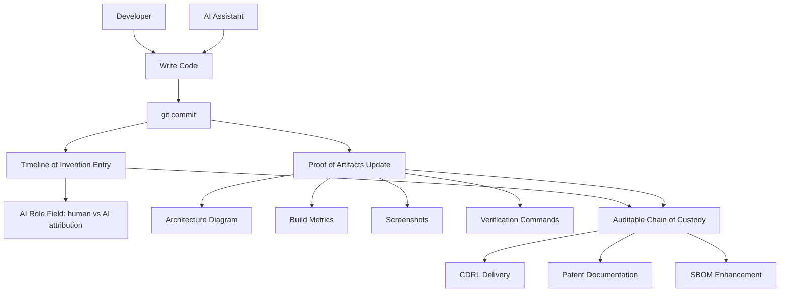

<!-- Unlicense — cochranblock.org -->

# Proof of Artifacts

*Visual and structural evidence that this framework works, ships, and is real.*

> This is not a proposal for something that might work. This is documentation of something that already works across 12 production repositories.

## Architecture



## Validation

| Metric | Value |
|--------|-------|
| Repositories using this framework | 12 |
| Total commits documented | 500+ |
| Languages | Rust (all repositories) |
| Framework overhead | 2 markdown files per repo |
| External dependencies | Zero (markdown + git) |
| Tooling required | git (already present in every dev environment) |

## Live Examples

Every repository at [github.com/cochranblock](https://github.com/cochranblock) contains:
- `PROOF_OF_ARTIFACTS.md` — build evidence
- `TIMELINE_OF_INVENTION.md` — dated human/AI attribution

## How to Verify

```bash
# Pick any repo
git clone https://github.com/cochranblock/cochranblock
cd cochranblock
cat TIMELINE_OF_INVENTION.md   # Human/AI attribution per entry
cat PROOF_OF_ARTIFACTS.md      # Build evidence + verification commands
git log --oneline              # Cross-reference TOI commit hashes
```

---

*Part of the [CochranBlock](https://cochranblock.org) zero-cloud architecture. All source under the Unlicense.*
