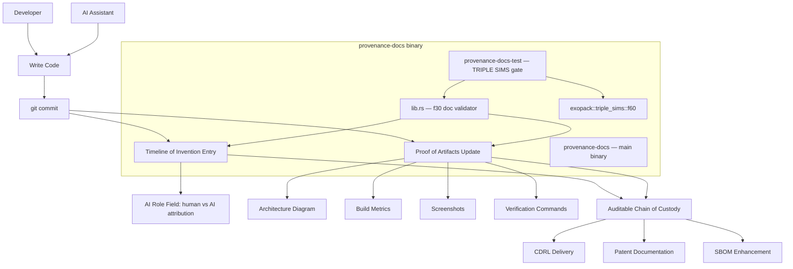

<!-- Unlicense — cochranblock.org -->

# Proof of Artifacts

*Visual and structural evidence that this framework works, ships, and is real.*

> This is not a proposal for something that might work. This is documentation of something that already works across 16 production repositories.

## Architecture



## Build Output

| Metric | Value |
|--------|-------|
| `provenance-docs` release (stripped) | 328 KB |
| `provenance-docs-test` release (stripped) | 432 KB |
| Rust edition | 2024 |
| External dependencies (default) | 0 |
| External dependencies (tests feature) | exopack, tokio |
| Cloud dependencies | Zero |
| Infrastructure cost | $0 — runs anywhere with `rustc` |

## Validation

| Metric | Value |
|--------|-------|
| Repositories using this framework | 16 |
| Repos with exopack test gate | 12 of 16 |
| Total commits documented | 500+ |
| Languages | Rust (all repositories) |
| Framework overhead | 2 markdown files per repo |
| External dependencies | Zero (markdown + git) |
| Tooling required | git (already present in every dev environment) |
| Two-binary model | Yes — exopack TRIPLE SIMS gate |
| Test gate | f30 validates TOI fields + POA sections |

## Screenshots

provenance-docs is a CLI framework with no GUI. Visual proof is the terminal output of the TRIPLE SIMS test gate:

```
  OK  TIMELINE_OF_INVENTION.md
  OK  PROOF_OF_ARTIFACTS.md
  OK  WHITEPAPER.md
  OK  TOI field **What:**
  OK  TOI field **Why:**
  OK  TOI field **Commit:**
  OK  TOI field **AI Role:**
  OK  TOI field **Proof:**
  OK  POA section ## Architecture
  OK  POA section ## Build Output
  OK  POA section ## Validation
  OK  POA section ## How to Verify
All checks passed
TRIPLE SIMS pass 1/3 OK (0ms)
...
TRIPLE SIMS: 3/3 passes OK
```

## Live Examples

Every repository at [github.com/cochranblock](https://github.com/cochranblock) contains:
- `PROOF_OF_ARTIFACTS.md` — build evidence
- `TIMELINE_OF_INVENTION.md` — dated human/AI attribution

## How to Verify

```bash
# Clone and build provenance-docs
git clone https://github.com/cochranblock/provenance-docs
cd provenance-docs
cargo build --release                              # 328 KB main binary
cargo run --bin provenance-docs-test --features tests  # TRIPLE SIMS 3/3

# Verify any other CochranBlock repo
git clone https://github.com/cochranblock/cochranblock
cd cochranblock
cat TIMELINE_OF_INVENTION.md   # Human/AI attribution per entry
cat PROOF_OF_ARTIFACTS.md      # Build evidence + verification commands
git log --oneline              # Cross-reference TOI commit hashes
```

---

*Part of the [CochranBlock](https://cochranblock.org) zero-cloud architecture. All source under the Unlicense.*
