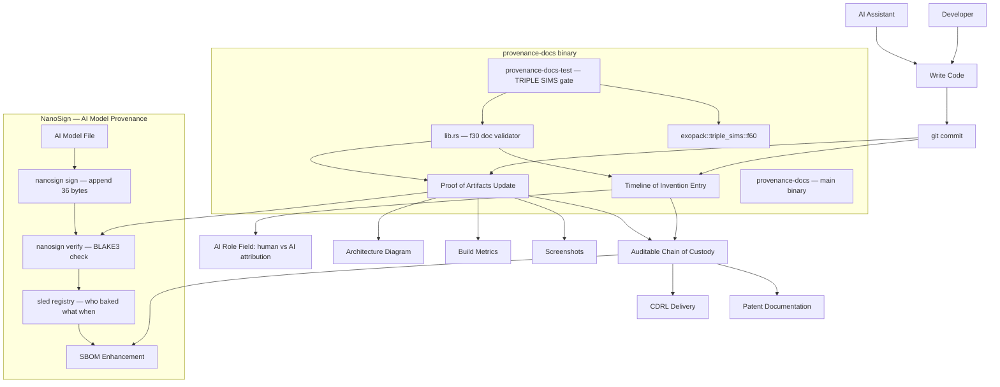

<!-- Unlicense — cochranblock.org -->

# Proof of Artifacts

*Visual and structural evidence that this framework works, ships, and is real.*

> This is not a proposal for something that might work. This is documentation of something that already works across 16 production repositories.

## Architecture



## Build Output

| Metric | Value |
|--------|-------|
| `provenance-docs` release (stripped) | 346 KB |
| `provenance-docs-test` release (stripped) | 432 KB |
| Rust edition | 2024 |
| External dependencies (default) | nix (POSIX signals for hot reload) |
| External dependencies (tests feature) | exopack, tokio |
| Supply chain audit | [govdocs/SUPPLY_CHAIN_AUDIT.md](../govdocs/SUPPLY_CHAIN_AUDIT.md) |
| Cloud dependencies | Zero |
| Infrastructure cost | $0 — runs anywhere with `rustc` |

## Validation

| Metric | Value |
|--------|-------|
| Repositories using this framework | 16 |
| Repos with exopack test gate | 12 of 16 |
| Total commits documented | 500+ |
| Languages | Rust (all repositories) |
| Framework overhead | 2 markdown files per repo |
| External dependencies | Zero (markdown + git) |
| Tooling required | git (already present in every dev environment) |
| Two-binary model | Yes — exopack TRIPLE SIMS gate |
| Test gate | f30 validates TOI fields + POA sections + commit hash format + date ordering + cross-doc consistency |

## Screenshots

provenance-docs is a CLI framework with no GUI. Visual proof is the terminal output of the main binary and TRIPLE SIMS test gate:

**Main binary** (`cargo run`) — structural checks are stable, hash counts grow with each commit:
```
  OK  TIMELINE_OF_INVENTION.md
  OK  PROOF_OF_ARTIFACTS.md
  OK  WHITEPAPER.md
  OK  BACKLOG.md
  OK  govdocs/SUPPLY_CHAIN_AUDIT.md
  OK  govdocs/CDRL_MAPPING.md
  OK  TOI field **What:**
  OK  TOI field **Why:**
  OK  TOI field **Commit:**
  OK  TOI field **AI Role:**
  OK  TOI field **Proof:**
  OK  POA section ## Architecture
  OK  POA section ## Build Output
  OK  POA section ## Validation
  OK  POA section ## Screenshots
  OK  POA section ## How to Verify
  OK  TOI hash <N hashes verified>
  OK  TOI dates in reverse-chronological order
  OK  Cross-doc: <N> POA hashes verified against TOI
  OK  Git history: <N> TOI hashes verified
  OK  POA Commit Log covers all <N> git commits
  OK  Bidirectional: <N> TOI hashes found in POA Commit Log
  OK  AI Role: <N> entries have dual attribution
All checks passed
```

**Test binary** (`cargo run --bin provenance-docs-test --features tests`):
```
[same checks repeated 3x]
TRIPLE SIMS pass 1/3 OK
TRIPLE SIMS pass 2/3 OK
TRIPLE SIMS pass 3/3 OK
TRIPLE SIMS: 3/3 passes OK
```

## Commit Log

| Hash | Date | Description |
|------|------|-------------|
| 55b2eac | 2026-03-26 | Initial whitepaper + TOI/POA + framework scaffold |
| b7d18be | 2026-03-27 | README with cochranblock.org backlink |
| 8e21788 | 2026-03-27 | Pin TOI commit hash to actual 55b2eac |
| 783564d | 2026-03-27 | Exopack integration: two-binary model, TRIPLE SIMS |
| b143ff4 | 2026-03-27 | POA expansion: Build Output, Screenshots, f30 updates |
| 4f9459a | 2026-03-29 | Whitepaper expansion: 16 repos, Section 3.5 enforcement |
| dc2bcfe | 2026-03-30 | Supply chain audit, hot reload, file cleanup |
| 7fd287a | 2026-03-31 | Pin TOI hashes, add POA commit log, complete self-documentation |
| 2c03770 | 2026-04-02 | Expand f30 validator: hash format, date ordering, cross-doc consistency |
| be91115 | 2026-04-02 | Pin commit hash 2c03770 in TOI, add POA commit log entry |
| 6ce4142 | 2026-04-02 | Update all docs: cross-link cochranblock.org, expand README |
| 5754bf5 | 2026-04-03 | Add NanoSign as first-class AI supply chain provenance mechanism |
| 3116cf0 | 2026-04-03 | Pin NanoSign commit, add missing POA entries, fold 6ce4142 into TOI |
| 46f2b0f | 2026-04-03 | NanoSign provenance mechanism with P23 Triple Lens validation |
| 7ff5698 | 2026-04-03 | Add prioritized BACKLOG.md: 20 work items |
| 1ccb79b | 2026-04-03 | f30 stages 7-9: git history, POA completeness, bidirectional cross-check |
| 5425bc8 | 2026-04-03 | Add machine-readable JSON-LD schema proposal (Section 2.3) |
| 7b915ed | 2026-04-03 | CDRL mapping, JSON-LD schema, f30 stage 10: govdocs + AI Role validation |
| aacefa0 | 2026-04-03 | NanoSign origin auth roadmap, stable POA screenshots, "12 of 16" fix |
| e691e4f | 2026-04-03 | Fix validate_ai_roles prefix bug, stash coverage, pin aacefa0 in TOI/POA |
| 2d6f83f | 2026-04-03 | P23 triple lens: readjust fire |

## Live Examples

Every repository at [github.com/cochranblock](https://github.com/cochranblock) contains:
- `PROOF_OF_ARTIFACTS.md` — build evidence
- `TIMELINE_OF_INVENTION.md` — dated human/AI attribution

## How to Verify

```bash
# Clone and build provenance-docs
git clone https://github.com/cochranblock/provenance-docs
cd provenance-docs
cargo build --release                              # 346 KB main binary
cargo run --bin provenance-docs-test --features tests  # TRIPLE SIMS 3/3

# Verify any other CochranBlock repo
git clone https://github.com/cochranblock/cochranblock
cd cochranblock
cat TIMELINE_OF_INVENTION.md   # Human/AI attribution per entry
cat PROOF_OF_ARTIFACTS.md      # Build evidence + verification commands
git log --oneline              # Cross-reference TOI commit hashes
```

---

*Part of the [CochranBlock](https://cochranblock.org) zero-cloud architecture. All source under the Unlicense.*
