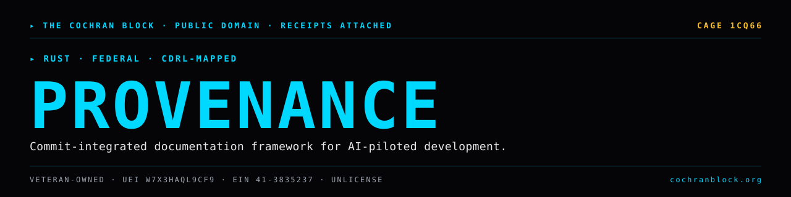

<!-- COCHRANBLOCK-BRAND-HEADER:START - generated by cochranblock/scripts/brand-stamp.sh -->
<picture>
  <source media="(prefers-color-scheme: dark)" srcset="assets/brand/banner.svg">
  <source media="(prefers-color-scheme: light)" srcset="assets/brand/banner.svg">
  
</picture>

[](https://unlicense.org)
[](https://www.rust-lang.org)
[](https://cochranblock.org)
[](https://cochranblock.org)

> &#9656; **RUST** &#183; **FEDERAL** &#183; **CDRL-MAPPED**
<!-- COCHRANBLOCK-BRAND-HEADER:END -->


# Provenance Docs v0.1.0

**Commit-integrated documentation framework for AI-piloted software development.**

A two-document chain of custody (TIMELINE_OF_INVENTION + PROOF_OF_ARTIFACTS) with a self-validating Rust binary (`f30`) and TRIPLE SIMS test gate. Designed for federal acquisition, deployed across 16 production repositories.

---

## Documentation

This README is the entry point. The actual docs live in two source-of-truth files at the root of the repo:

- **[PROOF_OF_ARTIFACTS.md](PROOF_OF_ARTIFACTS.md)** — what exists today, status, source-linked. Quick start, repository layout, Claude Code skill, architecture, build output, validation, screenshots, commit log, named techniques, verification commands. If you want to know what this project *does*, read this.
- **[TIMELINE_OF_INVENTION.md](TIMELINE_OF_INVENTION.md)** — dated, commit-level record with human/AI attribution per entry. If you want to know how this project *got built*, read this.

Supporting docs:
- [WHITEPAPER.md](WHITEPAPER.md) — full framework specification, CDRL mapping, SBIR phase plan
- [BACKLOG.md](BACKLOG.md) — prioritized open work
- [ASSUMED_BREACH_THREAT_MODEL.md](ASSUMED_BREACH_THREAT_MODEL.md) — threat model
- [govdocs/](govdocs/) — supply chain audit (EO 14028, NIST SP 800-218)
- [claude-skill/](claude-skill/) — offline Claude Code skill that drives the binary

---

## Run It

```bash
# Validate all docs (28 structural + hash/date/cross-doc checks)
cargo run

# TRIPLE SIMS quality gate (runs validation 3x, fails on first deviation)
cargo run --bin provenance-docs-test --features tests

# Install the binary system-wide
cargo install --path .
```

Full build, install, and skill-setup steps in [PROOF_OF_ARTIFACTS.md](PROOF_OF_ARTIFACTS.md).

---

## License

Unlicense (public domain). See [UNLICENSE](UNLICENSE).

Part of the [CochranBlock](https://cochranblock.org) zero-cloud architecture.
<!-- COCHRANBLOCK-BRAND-FOOTER:START - generated by cochranblock/scripts/brand-stamp.sh -->

---

<sub>&#9656; **THE COCHRAN BLOCK, LLC** &#183; Veteran-Owned &#183; **CAGE** `1CQ66` &#183; **UEI** `W7X3HAQL9CF9` &#183; **EIN** `41-3835237`</sub>

<sub>&#9656; PUBLIC DOMAIN &#183; UNLICENSE &#183; RECEIPTS ATTACHED &#183; [**cochranblock.org**](https://cochranblock.org) &#183; [github.com/cochranblock](https://github.com/cochranblock)</sub>
<!-- COCHRANBLOCK-BRAND-FOOTER:END -->
